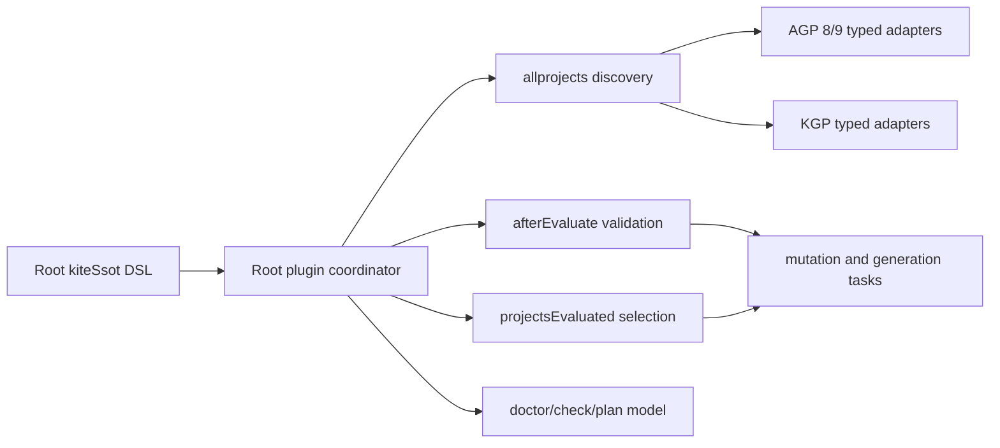
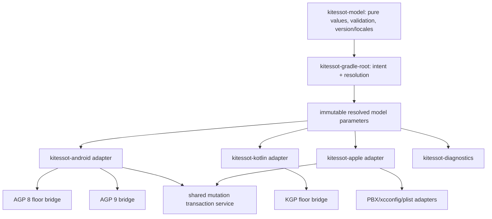

# SOLAUDIT — deep source-code audit of KiteSSOT

Audit date: 2026-08-19

Audited revision: `1e251ed2787b35f918d0889a122cd5aaef08da91`

Audit rule: implementation code, build logic, tests, checked-in ABI, and CI definitions are the only sources of truth. Documentation is cited only when it contradicts those sources. No website, issue tracker, release claim, or external product description was trusted. Direct executions are reported separately as supplemental verification and are not used to infer guarantees absent from the checked-in source.

## Executive verdict

KiteSSOT has an unusually serious source-mutation safety core, good bounded-input discipline, real AGP endpoint fixtures, ABI checking, reproducible archive settings, and useful deterministic diagnostics. Those are valuable foundations.

It is not yet safe to describe the current implementation as a universal or best-in-class Kotlin multiplatform SSOT plugin. One release blocker invalidates a core safety promise:

1. `-Pkitessot.dryRun` and `-Pkitessot.backups` use a permissive Boolean parser. A typo such as `treu` silently becomes `false`, so it can turn a preview into real source mutation or turn backups off.

Several high-impact gaps follow: `kiteSsotCheck` can pass models that ordinary builds reject, sole-KMP auto-detection is documented but absent, public programmatic nested configuration can be ignored, disabled features can still realize failing Providers, Android file integration bypasses variant/source APIs, `jvmTarget` is not actually whole-build alignment, and root-wide typed peer-plugin wiring blocks modern Gradle isolation.

This report records 49 actionable findings: 1 P0, 11 P1, 29 P2, and 8 P3. The count deliberately excludes mere preferences and duplicates; each numbered item has concrete source evidence and a corrective direction.

The correct near-term goal is not to add more targets. It is to make the contract truthful, deterministic, safe, and composable. Only then should the feature surface expand.

### Release recommendation

**Do not publish the current artifact as safe for unattended mutation.** Fix `SOL-P0-001`, add its negative integration tests, then clear the P1 contract/correctness group before expanding platform scope. A supplemental Gradle 8.5 explicit-typed-consumption probe found no incompatibility, but a published-marker `plugins {}` Kotlin DSL floor fixture should be checked into CI before treating that path as a source-backed guarantee.

### Severity model

| Priority | Meaning |
|---|---|
| P0 | Release blocker: compatibility failure, safety control bypass, or credible destructive behavior |
| P1 | High-impact correctness, contract, installation, or architectural failure |
| P2 | Material quality, parity, performance, maintainability, or feature-completeness gap |
| P3 | Lower-risk edge case, hygiene problem, or future-hardening opportunity |

## Full plain-English finding table

Each row below is standalone. P0 means release blocker, P1 means high impact, P2 means material improvement, and P3 means lower risk.

| Finding | Level | Problem in plain English | Recommended correction |
|---|---|---|---|
| SOL-P0-001 | P0 | A misspelled `kitessot.dryRun` or `kitessot.backups` command-line value silently becomes false. A supposed preview can therefore edit files, and a supposed backup can be disabled. | Accept only explicit `true` or `false`, and stop before any file change when the value is invalid. |
| SOL-P1-001 | P1 | The dedicated KiteSSOT check task skips validations that normal build configuration performs. Normal Gradle `check` also does not automatically run the KiteSSOT check task. | Use one validation engine for normal builds, doctor, plan, and check, then connect KiteSSOT checking to the normal verification lifecycle. |
| SOL-P1-002 | P1 | When a build contains exactly one Kotlin Multiplatform project, KiteSSOT does not automatically choose it as the shared project even though the source-level API contract says it will. Shared BuildConfig, locale discovery, native options, and web generation can then fail. | Select the only detected Kotlin Multiplatform project when no explicit shared project was supplied, and report clear errors for zero or multiple candidates. |
| SOL-P1-003 | P1 | Typed build logic can configure a public nested KiteSSOT object directly, but the feature stays disabled because a hidden flag is set only when the matching configuration block is opened. | Make the public `enabled` value the only activation authority and make block, Groovy, and programmatic configuration behave identically. |
| SOL-P1-004 | P1 | KiteSSOT reads and finalizes lazy values belonging to disabled features. A missing environment value in an unused feature can therefore break an unrelated build. | Keep disabled values lazy and finalize only values used by the resolved active configuration. |
| SOL-P1-005 | P1 | If no Android application is selected or detected, the Android logo task falls back to the repository root and writes into root `src/main/res`, where the files may be unused. | Require a real selected Android application or an explicit approved output directory; never use the root directory as a silent fallback. |
| SOL-P1-006 | P1 | Android logo, manifest, and diagnostic paths are hard-coded to `src/main`. Custom source sets, build types, product flavors, and generated resources can therefore be ignored. | Use Android variant and source APIs, or require explicit source destinations and reject unsupported variants. |
| SOL-P1-007 | P1 | Android logo synchronization reports success after writing image files even when the application manifest never references those images. | Verify manifest or merged-variant reachability before reporting success, or install a generated manifest overlay. |
| SOL-P1-008 | P1 | Android logo dry-run output lists files that will be written but omits old or colliding files that the real run will remove or back up. | Build one immutable plan containing every write, removal, replacement, and backup; print that plan in dry-run and execute the same plan in apply mode. |
| SOL-P1-009 | P1 | The `jvmTarget` setting changes Kotlin bytecode targets but does not consistently align Java compilation or configure compiler toolchains. Mixed Java and Kotlin projects can fail or produce mismatched bytecode. | Separate bytecode target from toolchain version and configure Kotlin, Java, and Android compilation consistently in every selected module. |
| SOL-P1-010 | P1 | KiteSSOT scans and configures all projects from the root, depends on evaluation-order callbacks, and requires peer plugin classes in the root classloader. This prevents proper Gradle Isolated Projects support and rejects common convention-plugin layouts. | Use project-local adapters that consume immutable model parameters without traversing or retaining other Gradle projects. |
| SOL-P1-011 | P1 | KiteSSOT models one base application identifier and version, while Android flavors, build types, and Xcode configurations can produce different values in the artifact users actually ship. Generated runtime constants can therefore disagree with the package. | Define an explicit variant policy and verify identifiers and versions from packaged artifacts rather than only from base configuration. |
| SOL-P2-001 | P2 | iOS locale synchronization only adds regions and never removes stale ones. Android Gradle Plugin 9 replaces the locale set, while Android Gradle Plugin 8 replaces only entries it can identify safely. | Offer explicit replace and merge policies and reconcile all supported Apple localization metadata, not only Xcode `knownRegions`. |
| SOL-P2-002 | P2 | Some Apple project and property-list rewrites change Windows-style line endings to Unix-style line endings or create files with mixed line endings. | Preserve each file's original line-ending and final-newline style and test Windows and Unix forms. |
| SOL-P2-003 | P2 | iOS icon synchronization detects unreferenced PNG files that can cause Xcode warnings but leaves them behind and still reports success. | Provide a reversible orphan-removal option or keep the condition as a persistent diagnostic warning. |
| SOL-P2-004 | P2 | Platform installation is split across independent leaf tasks, so one task can succeed while related platform state remains incomplete. | Add one install workflow with plan, preflight, apply, rollback, and final verification stages while retaining expert leaf tasks. |
| SOL-P2-005 | P2 | The Kotlin Multiplatform Android library adapter applies compile and minimum SDK values but does not apply the Android native-toolchain version or Java target settings that classic Android libraries receive. | Publish a capability matrix, implement every supported public hook, and report unsupported authoritative values as diagnostics instead of quiet log messages. |
| SOL-P2-006 | P2 | Apple build numbers derived from the shared version scheme are forced through Android's integer type and Google Play limit, even though Apple supports a different format and range. | Model a platform-neutral release number and encode it separately for Android and Apple. |
| SOL-P2-007 | P2 | Public writable properties can appear empty even when KiteSSOT has internally derived and applied a value. Consumer build logic cannot reliably read the configuration KiteSSOT actually uses. | Expose a separate read-only resolved model containing every effective value, its origin, and its selected target. |
| SOL-P2-008 | P2 | The published API includes unsupported adapter details and broad task implementation inputs alongside intentionally customizable task types. This makes accidental implementation details part of compatibility promises. | Explicitly classify the public API, keep deliberate customization contracts small, and hide unsupported implementation types. |
| SOL-P2-009 | P2 | Setting a new list property to an intentionally empty list can cause KiteSSOT to reuse a deprecated old list value instead of clearing it. | Distinguish “not supplied” from “supplied but empty,” and give the new property normal precedence. |
| SOL-P2-010 | P2 | Several errors suggest property names or configuration snippets that do not exist or are syntactically incomplete. Users can follow the advice and still get a broken build. | Generate messages from one set of canonical API paths and compile every suggested snippet in tests. |
| SOL-P2-011 | P2 | A Node.js-only Kotlin JavaScript target can pass the browser-target check and receive source that requires browser-only Worker, Blob, and object-URL APIs. | Verify the selected JavaScript environment, not only the broad JavaScript target type. |
| SOL-P2-012 | P2 | The browser worker feature is outside the core single-source-of-truth purpose and creates a new worker for every call while supporting only strings and raw JavaScript. | Move it to an optional module or redesign it with typed entry points, reusable workers, structured data transfer, and browser runtime tests. |
| SOL-P2-013 | P2 | The Xcode project parser limits input bytes but does not limit token count or nesting. A small but token-dense project file can still consume excessive memory. | Add token, nesting, object, and collection limits and test with a constrained Gradle heap. |
| SOL-P2-014 | P2 | Diagnostics and Apple file rewriting can keep several large text and byte copies in memory at once. Near-limit inputs can place unnecessary pressure on the Gradle process. | Decode and validate incrementally, avoid repeated encoding, and use smaller format-specific limits. |
| SOL-P2-015 | P2 | Android and iOS logo tasks decode, resize, and encode every image on every invocation, even when inputs and installed outputs are unchanged. | Compare bounded input fingerprints and output checksums before doing image rendering work. |
| SOL-P2-016 | P2 | KiteSSOT repeatedly inspects requested task dependency graphs and reads finalized values during configuration. This can realize tasks early and adds configuration overhead. | Resolve invocation mode once and make diagnostic behavior explicit instead of inferring it from the task graph. |
| SOL-P2-017 | P2 | The main plugin coordinator and file-safety implementation are very large, and two different filesystem transaction engines duplicate sensitive behavior. | Split model, discovery, validation, adapter, and task registration code, and consolidate one audited transaction engine. |
| SOL-P2-018 | P2 | Disposable files under Gradle's build directory use the same heavy ownership, takeover, recovery, and collision machinery as user-edited source files. | Use normal Gradle output replacement for build-owned generated files and reserve the full safety system for source-tree installation. |
| SOL-P2-019 | P2 | Apple support assumes a narrow text-based Xcode project layout. Binary property lists, configuration files, generated projects, workspaces, and several modern localization arrangements are unsupported. | Publish the exact supported Xcode shapes, detect and reject unsupported shapes clearly, and add adapters only where they can be tested. |
| SOL-P2-020 | P2 | Shared-module renaming updates only simple Swift `import OldName` lines. Test imports, exported imports, selective imports, Objective-C references, and configuration references can remain stale. | Support and test each promised reference form, and report exact unsupported references instead of claiming a complete migration. |
| SOL-P2-021 | P2 | The logo API says it creates every Apple application-icon slot, but the iOS task creates only one universal 1024-pixel entry. Android and Apple also expose different icon capabilities. | Define one platform-neutral icon intent, generate complete target-specific assets, and verify the assets inside built packages. |
| SOL-P2-022 | P2 | KiteSSOT accepts broad Android Gradle Plugin, Kotlin Gradle Plugin, Gradle, and Java combinations, but checked-in tests cover only a small set of endpoints. | Publish a machine-readable compatibility matrix, test representative combinations, and narrow or label untested ranges. |
| SOL-P2-023 | P2 | Platform tests mostly verify configuration or generated source, not the Android package, Xcode archive, or browser behavior that users actually ship. | Build and inspect Android packages, build or archive an Xcode fixture, and run browser tests under a realistic security policy. |
| SOL-P2-024 | P2 | The project has no enforced static analysis, code coverage threshold, fuzz testing, or performance regression gate. Sensitive parsers and file transactions can regress without a release failure. | Add formatting, linting, explicit API checks, controlled warnings-as-errors, coverage thresholds, property tests, fuzz tests, and performance budgets. |
| SOL-P2-025 | P2 | Shared generated BuildConfig code exposes root or Android-derived version values on iOS and omits independently configured Apple marketing and build versions. Runtime information can disagree with the iOS application. | Expose neutral release identity plus explicit Android and Apple version fields, or forbid divergent platform overrides. |
| SOL-P2-026 | P2 | The iOS `deploymentTarget` property only checks whether an icon format is allowed; it does not update or verify the real Xcode deployment target. | Rename it as an icon compatibility assertion or make it update and verify target-specific Xcode deployment settings. |
| SOL-P2-027 | P2 | BuildConfig fields are publicly stored as encoded strings. Numeric and Boolean values lose their type early, and only string fields accept lazy values. | Replace the raw string list with typed managed field objects that support lazy values for every supported type. |
| SOL-P2-028 | P2 | Monochrome Android icon generation reads only KiteSSOT's optional compile SDK value. It misses an Android application's own compile SDK when the KiteSSOT value is unset. | Read the finalized selected Android application's SDK or expose an icon option that does not depend on SDK ownership. |
| SOL-P2-029 | P2 | Nested Kotlin configuration blocks have no shared DSL marker, so a name inside one block can silently resolve to and modify an outer block. | Apply one DSL marker to every configuration receiver and add compile-failure tests for incorrect scope access. |
| SOL-P3-001 | P3 | A generated file move that changes only letter case can fail on the case-insensitive filesystems commonly used by macOS and Windows. | Detect same-file and case-only moves and test case and Unicode-normalization aliases on real case-insensitive volumes. |
| SOL-P3-002 | P3 | JSON diagnostic reports contain absolute checkout paths, which leak local machine details and make reports differ between machines. | Emit stable project-relative paths by default and make absolute paths an explicit option. |
| SOL-P3-003 | P3 | A misspelled `kitessot.color` command-line value silently becomes false instead of producing an error. | Reuse the strict Boolean parser required for the safety flags. |
| SOL-P3-004 | P3 | The worker API tells users to add the coroutine library themselves, but KiteSSOT does not detect its absence before generated source compilation fails. | Add a clear dependency preflight diagnostic or provide the dependency through an explicit version-safe mechanism. |
| SOL-P3-005 | P3 | Image tests do not prove that logo rendering produces stable pixels or bytes across supported operating systems and Java versions. | Define the reproducibility promise and test pixel or byte hashes across the supported environment matrix. |
| SOL-P3-006 | P3 | The README's test totals are lower than the actual source and executed test totals, so the published quality numbers are stale. | Generate test counts from test results or remove manually maintained counts. |
| SOL-P3-007 | P3 | Documentation deployment uses moving action, runner, Python, and package versions while the main build and release workflows are more tightly pinned. | Pin documentation actions, tools, runners, and dependencies with the same rigor as release automation. |
| SOL-P3-008 | P3 | Dependency verification checks artifact hashes but does not verify publisher signatures. Hashes detect drift but provide a weaker independent authenticity signal. | Enable signature verification where supported and maintain an explicit trusted-key policy. |

### Scorecard from current code

| Domain | Score | Source-based assessment |
|---|---:|---|
| Source-mutation safety internals | 8/10 | Strong containment, ownership, checksums, rollback, locks, bounded reads; undermined by CLI parsing and incomplete dry-run plans |
| Kotlin code quality | 6/10 | Generally idiomatic local code, but major coordinators are monolithic and lifecycle logic is duplicated |
| Public API design | 4/10 | Useful Provider types, but resolved and writable models diverge and internals leak into ABI |
| Kotlin DSL design | 4/10 | Readable nested blocks, but no DSL marker, hidden activation flags, legacy precedence traps, and stale names |
| Feature correctness | 5/10 | Core base-model propagation exists; variant, target, and validation parity gaps remain |
| Platform parity | 3/10 | Android base application and explicit iOS text mutation dominate; most Kotlin/Apple/desktop/web targets have partial or no platform integration |
| Installation/integrability | 5/10 | Checked-in published-shape fixtures pass and a supplemental Gradle 8.5 typed probe passes, but root classloader requirements and missing generated-accessor coverage are restrictive |
| Compatibility engineering | 6/10 | AGP 8/9 adapter split is thoughtful; endpoint-only matrices, generated-accessor coverage, and future/open-ended claims remain incomplete |
| Diagnostics/logging | 6/10 | Stable findings and SARIF are good; check/build validation differs, some advice is stale, and JSON paths leak machines |
| Performance/scalability | 5/10 | Bounded files and configuration cache help; eager Provider finalization, task graph inspection, image rerendering, and parser allocation remain |
| Test/release engineering | 7/10 | 263 tests, ABI/plugin validation, configuration-cache reuse, reproducible JAR settings; important real consumer/runtime paths are absent |
| Universal-player readiness | 3/10 | A credible Android+iOS foundation, not a universal cross-platform product yet |

## Repository and architecture inventory

### Measured shape

- Production implementation source: 12,583 lines (12,486 Kotlin plus the 97-line Java AGP 8 adapter).
- Test source: 5,855 lines.
- Test annotations: 263 across 25 test files; the executed suites contain 256 fast/unit-functional tests plus 7 real-compatibility tests.
- Largest production files:
  - `OwnedOutputSafety.kt`: 1,686 lines.
  - `KiteSsotPlugin.kt`: 1,447 lines.
  - `KiteSsotDiagnostics.kt`: 1,296 lines.
  - `KiteSsotExtension.kt`: 642 lines.
  - `RewriteSafety.kt`: 547 lines.
- Checked-in ABI exposes 34 public class/interface/file-facade entries, including task and adapter implementation details (`api/kitessot.api`).

### Current build contract

- The build applies `kotlin-dsl`, `java-gradle-plugin`, publishing, signing, Dokka, Plugin Portal, and CycloneDX plugins (`build.gradle.kts:29-37`).
- The wrapper is Gradle 9.5.1 (`gradle/wrapper/gradle-wrapper.properties:3`).
- Production compilation uses a JDK 21 toolchain but emits Java/Kotlin 17 bytecode (`build.gradle.kts:150-176`).
- Compile-time peer versions are AGP 9.3.1, AGP floor adapter 8.5.2, and KGP 2.4.10 (`gradle/libs.versions.toml:1-14`).
- Runtime gates accept AGP `8.5.2 <= version < 9.4.0` and KGP `2.4.x` (`PluginCompatibility.kt:27-42`).
- The plugin declares a Gradle minimum of 8.5 with no declared or runtime-enforced maximum (`KiteSsotPlugin.kt:43-47,1388`).
- It must be applied to the root project (`KiteSsotPlugin.kt:36-41`).
- Typed AGP/KGP integrations require peer plugin classes in the root classloader; otherwise requested features fail (`KiteSsotPlugin.kt:585-648`).

### Current execution architecture

`KiteSsotPlugin.apply` creates one root extension, registers all root tasks, traverses every project, discovers peer plugins, wires typed adapters, waits for root/subproject evaluation, validates the model, and configures diagnostics (`KiteSsotPlugin.kt:36-702`). The same class also owns KGP target wiring, source generation, locale detection, task registration, plan generation, compatibility probing, and model finalization through line 1,447.

This produces a single highly coupled lifecycle:



The architecture explains many findings: lifecycle-sensitive discovery, duplicated validation, root classloader constraints, poor isolated-project compatibility, and a coordinator that is difficult to reason about as one state machine.

## Actual platform capability matrix

Legend: **Implemented** means direct code exists; **Partial** means only a subset or base configuration; **Manual** means an explicit source mutation task rather than build-model integration; **None** means no platform adapter was found.

| Capability | Android application | Classic Android library | KMP Android library | iOS/Xcode app | Other Kotlin/Native | JVM/desktop | Browser JS | Node JS | wasmJs | macOS/tvOS/watchOS/visionOS |
|---|---|---|---|---|---|---|---|---|---|---|
| App name | Partial: manifest placeholder only | N/A | N/A | Manual PBX/plist rewrite | None | None | Runtime BuildConfig only | Runtime BuildConfig only | Runtime BuildConfig only | None |
| App/package ID | Partial: base `defaultConfig.applicationId` | N/A | N/A | Manual target-scoped PBX rewrite | None | None | Runtime BuildConfig only | Runtime BuildConfig only | Runtime BuildConfig only | None |
| Version/build number | Partial: base defaultConfig | N/A | N/A | Manual PBX/plist rewrite | None | None | Runtime BuildConfig only | Runtime BuildConfig only | Runtime BuildConfig only | None |
| Locales | Partial: AGP resource filter | None | None | Partial: additive `knownRegions` only | None | None | Runtime BuildConfig list | Runtime BuildConfig list | Runtime BuildConfig list | None |
| SDK/deployment target | compile/min/target/NDK | compile/min/NDK | compile/min only | `deploymentTarget` validates icon eligibility but is not written | None | None | None | None | None | None |
| JVM alignment | Conditional: Java compile options plus KGP-visible Kotlin tasks | Conditional: Java compile options plus KGP-visible Kotlin tasks | Conditional: KGP-visible Kotlin tasks only | N/A | N/A | Conditional: KGP-visible Kotlin tasks only | N/A | N/A | N/A | N/A |
| Launcher/App icon | Manual source-tree installer | N/A | N/A | Manual single-size 1024 catalog installer | None | None | None/PWA unsupported | None | None | None |
| Shared BuildConfig | Available only through a dependency on the selected shared KMP project | Available only through a dependency on the selected shared KMP project | Generated once in the selected KMP project's `commonMain` | Only through shared KMP code; no Xcode integration | Only through the selected shared KMP project | Only through the selected shared KMP project | Only through the selected shared KMP project | Only through the selected shared KMP project | Only through the selected shared KMP project | Only through shared KMP code; no Apple-project integration |
| Native compiler opt-ins | N/A | N/A | Native targets in the selected KMP project, if any | None: does not configure the Xcode app | All native compilations inside explicitly selected KMP projects | N/A | N/A | N/A | N/A | Native targets only when their KMP project is selected |
| Worker/offload helper | N/A | N/A | N/A | N/A | N/A | None | Partial: Blob browser worker | Claimed unsupported but selector check is incomplete | Explicitly rejected | None |
| Variant/configuration awareness | No | N/A | No | Target-aware, not configuration-overlay-aware | None | None | Target-name-aware | Incorrectly indistinguishable from browser by platform type | None | None |
| Real package/archive validation | No Android assemble fixture | No | compile/configure only | No Xcode archive | No | No installer/package tests | No browser runtime/CSP test | No | No | No |

### What “all platforms” currently omits

No implementation was found for JVM desktop metadata/installers, macOS apps, tvOS, watchOS, visionOS, Linux or Windows native packaging, Android dynamic features, Wear/TV-specific assets, iOS app extensions and per-configuration identity, web manifests/PWA icons, Node workers, wasm workers, or target-specific runtime metadata. BuildConfig generation in `commonMain` is portable source generation, but it is not platform installation or platform-policy integration.

### OS, IDE, and build-tool evidence

| Environment | Evidence in code/CI | Audit conclusion |
|---|---|---|
| Ubuntu / JDK 17 | Current-wrapper build plus an outer JDK 17 Groovy loading smoke test (`.github/workflows/ci.yml:21-26,75-96`) | Bytecode loading covered; Gradle-floor Kotlin DSL and AGP on JDK 17 are not |
| Ubuntu / JDK 21 | Current-wrapper build and the only real AGP compatibility job (`.github/workflows/ci.yml:25-26,98-101`) | Strongest tested host |
| macOS / JDK 21 | Full ordinary test/build/configuration-cache job (`.github/workflows/ci.yml:27-28`) | Mutator tests and conditional `xcodebuild -list` run, but there is no Xcode build/archive, dedicated case-only-volume fixture, or AGP compatibility suite |
| Windows / JDK 21 | Full ordinary test/build/configuration-cache job (`.github/workflows/ci.yml:29-30`) | Mutator tests run, but there is no dedicated CRLF/case-only-volume fixture or AGP compatibility suite |
| Gradle 8.5 | Checked-in Groovy published-shape fixture; no Kotlin marker/accessor fixture | The repository proves JVM/Groovy loading, not Kotlin DSL floor support. A supplemental explicit typed buildscript probe passed, but generated-accessor coverage is still missing |
| Gradle 9.5.1 | Main build and cache reuse | Covered for repository paths |
| Android Studio / IntelliJ import | No Tooling API or IDE sync fixture found | Generated source registration looks conventional, but IDE compatibility is unproved |
| Xcode | A checked-in PBX fixture is rewritten and conditionally validated with `xcodebuild -list` (`RealXcodeProjectCompatibilityTest.kt:17-76`) | Project parsing is covered on installed Xcode; no compile/archive or supported Xcode-version matrix |
| Gradle Isolated Projects | Cross-project architecture and KDoc state incompatibility | Unsupported by design (`SOL-P1-010`) |

## P0 — release blockers

### SOL-P0-001 — Misspelled CLI safety flags silently turn protection off

**Evidence**

`KiteSsotPlugin.kt:117-122` maps both Gradle properties with `String::toBoolean`:

```kotlin
target.providers.gradleProperty("kitessot.dryRun").map(String::toBoolean)
target.providers.gradleProperty("kitessot.backups").map(String::toBoolean)
```

Kotlin's permissive parser returns `true` only for case-insensitive `"true"`; every typo, blank-like value, or unrelated token becomes `false`. The override wins over the DSL (`KiteSsotExtension.kt:290-294`). Existing coverage exercises only valid `true` (`KiteSsotPluginFunctionalTest.kt:1405-1429`).

**Impact**

- `-Pkitessot.dryRun=treu` changes a requested preview into real filesystem mutation.
- `-Pkitessot.backups=treu` disables recovery backups.
- CI scripts can look protected while being unprotected.

This bypass occurs before the otherwise strong ownership/transaction layer and therefore negates its operator safety contract.

**Correction**

Parse only explicit `true` or `false` with a property-specific strict parser and fail configuration on anything else. Apply the same parser to `kitessot.color` at `KiteSsotPlugin.kt:100-103`, although that property is not destructive.

**Required acceptance tests**

- Invalid, empty, whitespace, numeric, and misspelled values fail before any task action.
- Valid case policy is defined and tested.
- CLI-over-DSL precedence is tested for all four combinations.
- Every source-mutating task is run behind an invalid flag fixture and proves zero mutation.

## P1 — high-impact correctness and contract findings

### SOL-P1-001 — `kiteSsotCheck` can pass a model that every normal build rejects

Diagnostic-only invocations call `disallowModelChanges` and return before normal model validation (`KiteSsotPlugin.kt:156-162`). SDK/NDK and published-version baseline checks occur later in `projectsEvaluated` (`KiteSsotPlugin.kt:499-515`). The diagnostic context has no SDK/NDK, `publishedVersionCode`, or `publishedBuildNumber` inputs (`KiteSsotDoctorTask.kt:39-83`, `KiteSsotDiagnostics.kt:39-82`), and the version diagnostic checks derivability rather than both store baselines (`KiteSsotDiagnostics.kt:861-892`). In addition, `kiteSsotCheck` is only registered (`KiteSsotPlugin.kt:1025-1033`); no consumer `check` lifecycle dependency is installed.

**Impact:** a CI job centered on `kiteSsotCheck` can be green for inconsistent SDK values or a regressing Play/App Store build number even though `help` or an ordinary build fails. Conversely, an ordinary `check` does not run KiteSSOT diagnostics unless the consumer explicitly invokes or wires the task.

**Fix:** create one pure resolved-model validation engine. Normal configuration should throw its errors; doctor/check should convert the exact same errors to findings. Integrate `kiteSsotCheck` with the conventional verification lifecycle using a clearly documented opt-out or opt-in policy. Add a parity table test that runs every validator through both entry points.

### SOL-P1-002 — Sole-KMP shared-module auto-detection is promised but absent

KDoc says the shared module is detected when there is only one (`KiteSsotExtension.kt:30-32`; `KiteSsotModulesExtension.kt:19-25`). The effective provider only reads `modules.shared.orElse(sharedProjectPath)` (`KiteSsotExtension.kt:298-300`). Detected KMP paths are collected (`KiteSsotPlugin.kt:335,386-388`) but never become that provider's fallback. BuildConfig fails with no explicit shared path (`KiteSsotPlugin.kt:237-241`), native/web later require one (`KiteSsotPlugin.kt:659-689`), and locale discovery returns empty without an explicit shared path/directory (`KiteSsotPlugin.kt:859-868`). Existing relevant fixtures set `modules.shared` explicitly.

**Impact:** the documented three-line setup cannot drive default locale discovery or shared-scoped features in the exact sole-KMP case it claims to support.

**Fix:** resolve an internal shared-project sink after discovery: explicit selector wins; exactly one detected KMP project is selected; zero and multiple candidates produce precise feature-dependent errors. Do not mutate the public input property to represent discovery.

### SOL-P1-003 — Public nested-object configuration can be silently ignored

Public getters expose `logo`, `nativeOptIns`, `buildConfig`, `ios.sync`, and `web.ioWorker`, but hidden `configured` flags are set only when the corresponding `Action` method is called (`KiteSsotExtension.kt:191-232`, `KiteSsotIosExtension.kt:171-182`, `KiteSsotWebExtension.kt:31-37`). Effective gates require those flags (`KiteSsotExtension.kt:417-477`).

**Impact:** compiled convention plugins and programmatic users can obtain the public nested object and call `enabled.set(true)` or populate its properties, yet the feature remains off. The public object is not a complete configuration API.

**Fix:** make `enabled` the sole authority. Let block entry set `enabled.convention(true)` while absence resolves to false. Remove hidden presence flags. Test Kotlin DSL block usage, Groovy closure usage, and direct typed programmatic configuration as equivalent paths.

### SOL-P1-004 — Disabled features still realize dormant Provider values

Normal evaluation calls `finalizeModel` (`KiteSsotPlugin.kt:330`). It calls `finalizeValue()` on every current and legacy DSL value, active or dormant (`KiteSsotPlugin.kt:1311-1385`). BuildConfig deliberately creates a throwing fallback for an absent custom-field Provider (`KiteSsotBuildConfigExtension.kt:140-155`), despite task-action code otherwise trying to resolve only active inputs (`GenerateBuildConfigTask.kt:64-73`).

**Impact:** `enabled=false` does not isolate unused values. Missing environment/Gradle Providers in a dormant feature can fail unrelated builds, contradicting the lazy API and “false always wins” contract.

**Fix:** use `disallowChanges()` without eager realization and `finalizeValueOnRead()`, or finalize only the inputs selected by an immutable active model. Add dormant-feature tests containing missing and deliberately throwing Providers.

### SOL-P1-005 — Missing Android application selection writes into the root source tree

With zero detected Android applications, selection falls back to `target.layout.projectDirectory` (`KiteSsotPlugin.kt:556-577`). The logo and cleanup tasks then append `src/main/res` (`KiteSsotPlugin.kt:955-982`). A functional test currently confirms this root output behavior (`KiteSsotPluginFunctionalTest.kt:1405-1429`).

**Impact:** a configuration/discovery mistake creates plausible but unused Android resources in the repository root instead of failing closed. This is especially dangerous because logo tasks are explicit source mutators.

**Fix:** require exactly one selected/detected Android application or an explicit approved output directory. A root project is valid only if it actually applies `com.android.application`, not merely because it is the fallback directory.

### SOL-P1-006 — Android file integration ignores AGP source sets and variants

Diagnostics hard-code `src/main/AndroidManifest.xml` and `src/main/res` (`KiteSsotPlugin.kt:481-484,1218-1222`). Logo installation hard-codes the same resource location (`KiteSsotPlugin.kt:967-969`). Identity wiring changes base `defaultConfig` only (`ClassicAndroidWiring.kt:33-49`).

**Impact:** custom `sourceSets`, generated manifests/resources, flavors, build types, `applicationIdSuffix`, `versionNameSuffix`, and variant overrides can make generated resources unreachable or make the generated BuildConfig identity disagree with the shipped variant. Diagnostics inspect source-main text rather than merged variant artifacts.

**Fix:** integrate through Android Components variant/source artifact APIs. Model whether identity is global or variant-specific. At minimum, expose explicit source sinks and fail when a selected variant is not covered.

### SOL-P1-007 — Android logo sync can report success while the app does not use the logo

`SyncAndroidLogoTask.sync` renders and installs resources without reading or updating a manifest (`SyncAndroidLogoTask.kt:71-216`). Manifest reachability is checked only by separate diagnostics (`KiteSsotDiagnostics.kt:396-420`), and the functional fixture manually seeds icon references (`KiteSsotPluginFunctionalTest.kt:649-655`).

**Impact:** the success message at `SyncAndroidLogoTask.kt:216` proves files were installed, not that the packaged app selects them.

**Fix:** preflight manifest/variant reachability before committing, or register a generated manifest overlay through AGP. Make the normal install workflow finish with verification and fail if the assets are not selected.

### SOL-P1-008 — Android takeover dry-run omits files the real run deletes

Collisions are found at `SyncAndroidLogoTask.kt:145-147`, but dry-run logs only rendered writes and returns at `SyncAndroidLogoTask.kt:184-187`. Legacy/collision takeover files are assembled only after that return and passed to the destructive transaction at `SyncAndroidLogoTask.kt:189-204`.

**Impact:** the preview is materially false by omission: users cannot see the deletion/backup portion of the operation they are approving.

**Fix:** create one immutable mutation plan containing writes, replacements, removals, backups, ownership changes, and skipped conflicts. Dry-run renders it; apply executes the same object. Test that preview and transaction sets are identical.

### SOL-P1-009 — `jvmTarget` is not whole-build Java/Kotlin alignment

KDoc calls it a whole-build policy (`KiteSsotExtension.kt:97-103`). `KotlinJvmTargetWiring` only configures `KotlinCompile.compilerOptions.jvmTarget` (`KotlinJvmTargetWiring.kt:21-25`). Java source/target compatibility is set only in classic Android adapters (`ClassicAndroidWiring.kt:66-70,86-90`; `Agp8ClassicAndroidWiring.java:88-96`). Pure Kotlin/JVM, Java, and KMP JVM-with-Java modules retain their own Java compatibility. The plugin configures no consumer Java/Kotlin toolchain and no `JavaCompile.options.release`.

The validator accepts 8 through 26 blindly (`SsotValidation.kt:237-242`). Gradle 8.5 maps 26 to `JavaVersion.VERSION_HIGHER` while stringifying it as `26`; KGP 2.4.10 has explicit JVM targets through 26. The immediate conversion can work, but the CI-tested daemon JDKs 17/21 cannot compile Java source for 22–26 without a separately installed/configured compiler. CI and mapping tests stop at 21 (`.github/workflows/ci.yml:21-30`, `JavaVersionMappingTest.kt:14-20`).

**Fix:** split bytecode target from compiler toolchain, configure Java and Kotlin toolchains per selected module, align `JavaCompile --release`, validate the active tuple, and test mixed Java/Kotlin JVM and KMP modules.

### SOL-P1-010 — Root-wide typed peer-plugin architecture blocks modern Gradle isolation

The plugin traverses `allprojects`, installs plugin callbacks, and uses project `afterEvaluate` plus `projectsEvaluated` (`KiteSsotPlugin.kt:340-437`). Typed KGP/AGP features fail when peer classes live in sibling classloaders and require root `apply false` declarations (`KiteSsotPlugin.kt:585-613`). `KiteSsotAccess.kt:44-45` explicitly notes incompatibility with Gradle Isolated Projects.

**Impact:** common convention-plugin/subproject-only arrangements are rejected; configuration-on-demand and isolated projects cannot be first-class; root discovery and target configuration are one global mutable lifecycle.

**Fix:** split into a settings/root model plugin and project-local adapter plugins. Have each adapter consume serializable immutable model parameters without retaining `Project` instances or traversing sibling projects, and keep AGP/KGP types out of the aggregator classloader. A Build Service may coordinate non-project state, but it does not itself make cross-project configuration isolation-safe.

### SOL-P1-011 — Base identity can disagree with real Android/iOS variants

Android ID is derived from one base plus one SSOT suffix (`KiteSsotExtension.kt:240-246,450`), then applied to `defaultConfig` (`ClassicAndroidWiring.kt:33-45`). Android flavor/build-type suffixes and variant overrides remain free to change the packaged ID/version. iOS rewrites selected target build settings across configurations but offers no Debug/Release overlay model (`PbxprojRewrite.kt:108-180`). Generated BuildConfig emits only one Android and one iOS ID (`BuildConfigGen.kt:128-137`).

**Impact:** runtime constants and diagnostics can be correct for the base model and wrong for the actual artifact.

**Fix:** define variant policy explicitly: prohibit downstream overrides, expose per-environment overlays, or generate a variant-aware API. Verify packaged manifests/Info.plists rather than base DSL alone.

## P2 — material design, parity, completeness, and performance findings

### SOL-P2-001 — iOS locale propagation is additive while Android replacement differs by AGP line

iOS preserves every existing region and adds desired locales (`PbxprojRewrite.kt:197-200`). AGP 9 clears/replaces locale filters (`ClassicAndroidWiring.kt:50-57`); the AGP 8 adapter removes only entries recognized as unambiguous locale qualifiers before adding the desired set (`Agp8ClassicAndroidWiring.java:45-59`; `LocaleTags.kt:125-131`). Thus AGP 9 is authoritative, AGP 8 is best-effort for ambiguous qualifiers, and iOS remains additive. Removing a locale from SSOT can therefore leave stale Xcode metadata, while `knownRegions` alone also does not reconcile `.lproj` directories, string catalogs, or `CFBundleLocalizations`.

**Fix:** expose an exact-versus-merge policy. Exact mode should reconcile all supported Apple localization metadata and preserve only required project/development regions.

### SOL-P2-002 — CRLF source files are not preserved consistently

Plist serialization normalizes to LF (`PlistSanitize.kt:340-345`) and is byte-compared with the original representation (`PlistSanitize.kt:90-98`), so valid CRLF plists can be rejected as an unrelated rewrite. PBX `knownRegions` replacement inserts literal LF (`PbxprojRewrite.kt:202-209`), creating mixed endings in CRLF projects.

**Fix:** detect and preserve the original EOL convention and final-newline state. Add LF, CRLF, no-final-newline, and mixed-input fixtures on Windows and Unix.

### SOL-P2-003 — iOS AppIcon sync knowingly leaves Xcode-warning-producing orphans

The task warns about unreferenced PNGs but does not take them over (`SyncIosLogoTask.kt:194-236`), then logs success (`SyncIosLogoTask.kt:177`). Diagnostics validate expected owned files but do not persist the orphan warning (`KiteSsotDiagnostics.kt:699-713`).

**Fix:** add explicit reversible orphan takeover/removal or make the orphan condition a persistent diagnostic warning after installation.

### SOL-P2-004 — Installation is split into non-atomic leaf tasks

iOS sanitization, iOS config, iOS logo, Android logo, and legacy cleanup are registered independently (`KiteSsotPlugin.kt:146-150`) with no aggregate transaction or final verification. One task can succeed while the dependent platform state is still incomplete.

**Fix:** keep expert leaf tasks but add `kiteSsotInstall` with plan → preflight → apply → verify semantics, explicit ordering, and cross-step recovery reporting.

### SOL-P2-005 — KMP Android library misses NDK and Java-target parity

The KMP Android adapter applies only compileSdk/minSdk and logs targetSdk/NDK as ignored (`KmpAndroidLibraryWiring.kt:25-27,39-48`). A classic Android library additionally applies NDK and Java source/target compatibility (`ClassicAndroidWiring.kt:74-91`); the KMP adapter has neither hook. Both library shapes lack targetSdk and application-locale policy, so those are not KMP-specific disparities, although quietly logging an inapplicable authoritative targetSdk remains weak unsupported-value handling.

**Fix:** publish an explicit capability matrix per Android plugin shape and fill supported hooks through the public KMP Android Components API. Warnings about ignored authoritative values should be diagnostics, not low-visibility `info` logs.

### SOL-P2-006 — The shared build-number abstraction leaks Android's limit into Apple

`VersionCodeScheme.compute` returns `Int` and documents the Play ceiling (`VersionScheme.kt:77-80`). `computeVersionCode` always calls `validateResolvedVersionCode` (`VersionResolution.kt:38-61`), including for the iOS provider (`KiteSsotExtension.kt:348-356`). Manual Apple build numbers support one to three numeric components (`SsotValidation.kt:75-83,111-130`), but scheme-derived Apple numbers cannot use that space and are capped by Google Play.

**Fix:** model a platform-neutral release ordinal separately from platform encoders, or use distinct Android `Int` and Apple build-number scheme types. Do not make Apple policy a side effect of an Android-named validator.

### SOL-P2-007 — Writable DSL properties do not expose the values the plugin actually applies

For example, `android.versionCode` is documented as defaulting from the root scheme (`KiteSsotAndroidExtension.kt:48-55`) but is not conventioned; derivation exists only in internal `effectiveAndroidVersionCode` (`KiteSsotExtension.kt:333-342`). Similar divergence exists for iOS marketing/build versions and gates. KDoc refers to nested `applicationId`/`bundleId` providers that are absent from the actual ABI (`KiteSsotAndroidExtension.kt:27-29`, `KiteSsotIosExtension.kt:39-40`, `api/kitessot.api`).

**Impact:** consumer build logic reading the natural public property sees “absent” while KiteSSOT applies a derived value elsewhere.

**Fix:** expose a stable read-only `resolved` model with all effective values, origins, and selection results. Keep writable inputs separate from resolved outputs.

### SOL-P2-008 — Public ABI intent is not consistently curated

`Agp8AndroidInputs` explicitly says it is not supported API (`Agp8AndroidInputs.kt:13-15`) but is public in `api/kitessot.api:1-18`; that is a confirmed leak. The ABI also exposes generator/mutator tasks and the full diagnostic task-base input surface (`api/kitessot.api:20-56,95-155,304-467`). Some task exposure is intentional in source: `KiteSsotCheckTask` publicly documents configurable report properties (`KiteSsotCheckTask.kt:15-55`), and consumer-side typed `GenerateBuildConfigTask` configuration is exercised (`KiteSsotPluginFunctionalTest.kt:572-605`). `SsotVersion` says consumers never construct it but has a public constructor (`VersionScheme.kt:30-47`).

**Impact:** the checked-in ABI does not distinguish deliberate customization contracts from public JVM shapes required by Gradle implementation mechanics. Accidental surfaces become semver-sensitive alongside intentional ones.

**Fix:** enable explicit API mode and classify every public type/member. Preserve deliberate task/options APIs as small stable contracts, split them from implementation inputs where possible, internalize unsupported adapters such as `Agp8AndroidInputs`, and narrow constructors/value types to their documented lifecycle.

### SOL-P2-009 — Explicit empty new-style lists can resurrect deprecated values

New list properties receive empty conventions (`KiteSsotPlugin.kt:66-83`). Resolution treats empty lists as absence and falls back to legacy inputs (`KiteSsotExtension.kt:304-306,452-456`). Users therefore cannot reliably clear deprecated `androidApplicationProjects`, `extraOptIns`, or `interopProjectPaths` through the new API.

**Fix:** leave new properties absent by default and use `new.orElse(legacy).orElse(emptyList())`, or track explicit presence separately from content. Test empty as an intentional value.

### SOL-P2-010 — Error output directs users to nonexistent DSL properties

Examples include:

- `web.projectPaths` and `web { projectPaths }` (`KiteSsotPlugin.kt:679-681`).
- `browserTargetNames` (`KiteSsotPlugin.kt:751-757`).
- `ioWorkerPackage` (`KiteSsotPlugin.kt:774`).
- `generateIoWorker` in KDoc (`KiteSsotPlugin.kt:734-738`).
- `ndkVersion` instead of `android.ndk` (`SsotValidation.kt:254-263`).
- `ios.targetNames` instead of `ios { sync { targets } }` (`SyncIosConfigTask.kt:312-313`, `PbxprojTargetScope.kt:367`).
- Malformed `modules { androidApps(":app").` advice with missing closing syntax (`KiteSsotPlugin.kt:535,563`).

`MessageHygieneTest.kt:15-38` scans only an enumerated legacy-name list, so these strings escape it.

**Fix:** centralize canonical DSL paths and generate every message from them. Compile every suggested snippet as a test.

### SOL-P2-011 — Node-only JS targets can pass the browser selector check

The contract says Node is unsupported (`KiteSsotIoWorkerExtension.kt:50-57`), but target validation only requires `KotlinPlatformType.js` (`KiteSsotPlugin.kt:760-766`). An explicitly named Node-only JS target therefore passes and receives browser-only Blob/Worker source. Existing coverage checks Node only when no selector is supplied (`KiteSsotPluginFunctionalTest.kt:440-468`).

**Fix:** inspect the selected JS target's environment/subtarget, or redesign the DSL so browser capability is a verified adapter rather than a target-name assertion.

### SOL-P2-012 — Browser worker generation is scope creep and an inefficient runtime primitive

Generated source accepts raw trusted JavaScript, concatenates it into worker bootstrap code, requires `worker-src blob:`, and is browser-only (`IoWorkerGen.kt:21-72`). Every call creates a Blob, object URL, and Worker, then terminates it (`IoWorkerGen.kt:94-169`). Transport is String-only; there is no structured clone typing, transferables, pooling, progress, or module-function model.

**Impact:** the feature adds security/CSP guidance and runtime machinery unrelated to SSOT identity, while remaining less capable than a dedicated worker library.

**Fix:** move it to an optional plugin/module. Prefer typed worker entrypoints/module URLs, reusable workers or a pool, structured clone/transferable support, and browser runtime tests. If retained, reject Node accurately.

### SOL-P2-013 — PBX input byte limits do not bound parser allocation

Text rewrites allow up to 64 MiB (`RewriteSafety.kt:21,43-49`). `lexPbx` creates a `Token` object per atom/symbol in an unbounded `ArrayList` (`PbxprojTargetScope.kt:30-83`). A token-dense file below the byte cap can allocate millions of objects and exhaust a Gradle daemon.

**Fix:** add token, nesting, object, and collection limits; use a PBX-specific smaller byte limit or a streaming scanner; test under a constrained heap.

### SOL-P2-014 — Diagnostics amplify large-file memory use

Diagnostic text reads allow up to 64 MiB (`KiteSsotDiagnostics.kt:1181`) and create Strings; UTF-8 validation can encode the text again (`KiteSsotDiagnostics.kt:1044-1053`). iOS rewrites also hold original text, tokens, rewritten text, encoded output, and transaction snapshots. The configured 2 GiB daemon heap (`gradle.properties:1`) hides this amplification in project CI.

**Fix:** decode incrementally, avoid String re-encoding, use per-format budgets, and benchmark near-limit files with a 512 MiB daemon.

### SOL-P2-015 — Source logo tasks rerender everything on every invocation

Both logo tasks force out-of-date execution (`SyncAndroidLogoTask.kt:38-44`, `SyncIosLogoTask.kt:37-43`). Android decodes inputs and renders/encodes the complete density set before reaching the ownership transaction (`SyncAndroidLogoTask.kt:93-182`); iOS does the same for its 1024 image (`SyncIosLogoTask.kt:88-145`).

Always running source mutators is defensible for safety, but expensive rendering need not precede a manifest/input-fingerprint no-op check.

**Fix:** compute bounded hashes and parameters first, validate ownership/current outputs, and short-circuit before decode/render when both input fingerprint and output checksums match. Add JMH or Gradle Profiler measurements.

### SOL-P2-016 — Configuration lifecycle work is repeated and can realize tasks

`isResilientDiagnosticInvocation` resolves root tasks and walks dependency closures (`KiteSsotPlugin.kt:1271-1308`). It is called from several plugin callbacks and lifecycle phases. Normal configuration also performs extensive `.get()` calls in `afterEvaluate`/`projectsEvaluated` and finalizes the entire model.

**Fix:** compute invocation mode once, avoid task-graph inference as a model-validity switch, and make resilient validation an explicit task behavior rather than a special alternate configuration lifecycle.

### SOL-P2-017 — The coordinator and safety layers are oversized and duplicated

`KiteSsotPlugin.kt` is 1,447 lines and mixes model creation, discovery, compatibility, validation, adapters, codegen, mutation task wiring, diagnostics, and task-graph logic. `OwnedOutputSafety.kt` is 1,686 lines, while `RewriteSafety.kt:126-365,492-547` independently implements related stable reads, staging, parking, atomic moves, rollback, and directory forcing.

**Impact:** correctness must be proved across two filesystem transaction implementations and one very large Gradle lifecycle state machine.

**Fix:** consolidate a single audited transaction primitive, keep ownership/install policy thin, and split plugin model/discovery/validation/adapters/task registration into isolated components.

### SOL-P2-018 — Build-owned generated trees use source-installer-grade machinery

`GenerateBuildConfigTask` and `GenerateIoWorkerTask` have proper `@OutputDirectory` declarations (`GenerateBuildConfigTask.kt:23-52`, `GenerateIoWorkerTask.kt:28-46`) but route generation through the full ownership engine (`GenerateBuildConfigTask.kt:78-84`, `GenerateIoWorkerTask.kt:63-69`). Build directories are disposable and already modeled by Gradle; rejecting unknown IDE/cache content inside a declared output can create unnecessary friction.

**Fix:** use normal Gradle output replacement/atomic file writes for build-owned directories. Reserve provenance, takeover, recovery DBs, and user-file collision policy for source-tree installers.

### SOL-P2-019 — The Xcode adapter supports a narrow project representation

The implementation edits PBX project text, XML plist, Podfile, and Swift source directly. It requires structurally existing PBX settings and fails on ambiguous/missing structures (`PbxprojRewrite.kt:108-215`, `SyncIosConfigTask.kt:303-336`). Binary plists, xcconfig-authoritative builds, XcodeGen/Tuist regeneration, string catalogs/localization resources, workspaces, archive/signing, and tool-based validation are outside the implementation.

**Fix:** state the supported Xcode project shapes as a versioned contract. Add adapters for xcconfig/generated-project workflows or refuse them with detection. Run `xcodebuild -showBuildSettings` and a minimal archive in macOS CI for supported shapes.

### SOL-P2-020 — Shared-module migration recognizes only plain Swift imports

The matcher handles line-anchored plain `import OldModule` (`SharedModuleRewrite.kt:266-283`). It misses `@testable import`, `@_exported import`, selective imports, Objective-C headers/imports, xcconfig references, and other valid module references.

**Fix:** enumerate supported forms, rewrite them safely, and fail with exact unsupported-reference findings instead of reporting a complete migration.

### SOL-P2-021 — App icon feature coverage is dated and non-parallel

Android generates fixed launcher names/densities/adaptive wrappers and optional monochrome; it has no manifest overlay, custom resource names, WebP/vector input strategy, or flavor-aware set. The public logo KDoc promises “every Apple AppIcon slot” (`KiteSsotLogoExtension.kt:18-20`), but iOS emits only one 1024 universal entry (`SyncIosLogoTask.kt:124-177,259-268`) and no dark/tinted appearances or non-iOS Apple catalogs. This is a direct source-contract contradiction, and the platforms do not share an equivalent asset capability model.

**Fix:** create a platform-neutral asset intent plus platform encoders, expose names and appearance policies, and validate packaged assets per target/variant.

### SOL-P2-022 — Compatibility ranges are broader than executed evidence

The runtime accepts every AGP 8.5.2–9.3.x and KGP 2.4.x release (`PluginCompatibility.kt:27-42`). Compatibility-tagged published-shape fixtures exercise AGP 8.5.2 and 9.3.1 endpoints with KGP 2.4.0 (`AgpCompatibilityFunctionalTest.kt:106-180,452-520`). Ordinary TestKit KMP tests also receive KGP 2.4.10 through the injected plugin classpath (`build.gradle.kts:310-320`; `gradle/libs.versions.toml:4-6`), but this still does not prove the whole accepted 2.4.x/AGP/Gradle/JDK Cartesian range. Gradle is tested at 8.5/current for plugin loading and 8.9/9.5.1 in AGP fixtures. There is no upper Gradle gate.

**Fix:** publish an evidence matrix and test representative minor boundaries/peer tuples. Treat untested versions as experimental or narrow the runtime gate.

### SOL-P2-023 — Real platform tests stop before the artifact users ship

AGP fixtures assert configuration values but do not build an APK/AAB and inspect its merged manifest/resources. KMP BuildConfig proves JVM compilation, not all target compilations. The real Xcode fixture conditionally proves `xcodebuild -list` can parse the rewritten project (`RealXcodeProjectCompatibilityTest.kt:54-76`), but it does not compile or archive an app. The worker compiles but has no browser/CSP/runtime test. No composite build, included build, convention-plugin classloader, isolated-project, custom source-set, or flavored app fixture exists.

**Fix:** add artifact-level acceptance suites: Android assemble and APK inspection, Xcode build/archive and Info.plist/asset inspection, browser tests under strict CSP, and all supported Gradle/plugin layout shapes.

### SOL-P2-024 — No static-analysis, coverage, fuzzing, or performance gate exists

The build plugins contain no Detekt, ktlint, Kover/JaCoCo, binary compatibility policy beyond ABI snapshots, fuzz/property framework, or benchmark plugin (`build.gradle.kts:29-37`). No warnings-as-errors/explicit-API setting is present. Parser, locale, version, path, and transaction code would benefit strongly from generative tests.

**Fix:** add formatting/lint, explicit API, compiler warnings-as-errors with controlled opt-outs, line/branch coverage thresholds for critical packages, property/fuzz tests for parsers and transactions, and performance baselines.

### SOL-P2-025 — Generated BuildConfig reports Android-derived version identity on iOS

The generated common object emits root `versionName`, Android `versionCode`, Android application ID, and iOS bundle ID (`KiteSsotPlugin.kt:823-845`, `BuildConfigGen.kt:128-137`). It does not emit the independently configurable `ios.marketingVersion` or `ios.buildNumber` (`KiteSsotIosExtension.kt:54-92`).

**Impact:** common runtime code on iOS can report Android/root version values even when the Xcode artifact intentionally uses Apple-specific overrides. The supposed cross-platform runtime SSOT is asymmetric.

**Fix:** emit a neutral release identity plus explicit `androidVersionCode`, `iosMarketingVersion`, and `iosBuildNumber`, or prohibit divergent platform overrides when identity generation is enabled. Verify values against packaged artifacts.

### SOL-P2-026 — iOS deployment target is an icon-validation hint, not SSOT propagation

`ios.deploymentTarget` is documented and implemented only as an AppIcon eligibility check; it explicitly does not change `IPHONEOS_DEPLOYMENT_TARGET` (`KiteSsotIosExtension.kt:118-126`). Android SDK levels, by contrast, are written into Android DSL adapters (`ClassicAndroidWiring.kt:59-70`).

**Impact:** a property that looks like platform configuration can disagree with the real Xcode deployment target. Platform SDK/deployment policy is not parallel.

**Fix:** rename the current input to an icon-specific compatibility assertion, or make deployment target a real target/configuration-aware Apple setting and validate it through `xcodebuild -showBuildSettings`.

### SOL-P2-027 — BuildConfig's public field model is a raw string transport

`KiteSsotBuildConfigExtension.fields` is described as a legacy representation but remains a public, non-deprecated `ListProperty<String>` (`KiteSsotBuildConfigExtension.kt:105-116`). Typed helpers immediately serialize values back to strings (`KiteSsotBuildConfigExtension.kt:118-174`), and only `stringField` accepts a `Provider`; numeric and Boolean Provider values have no typed path.

**Impact:** arbitrary consumers can mutate the parser transport directly, the public ABI freezes a textual grammar, and lazy typed values lose type information before model resolution.

**Fix:** replace it with a managed typed field container/spec hierarchy that supports Providers for every value type. Keep raw `fields` only as a deprecated compatibility bridge until the next major removal window.

### SOL-P2-028 — Monochrome Android icons depend on the wrong compileSdk source

The v33 wrapper decision reads only `kiteSsot.android.compileSdk` (`KiteSsotPlugin.kt:963`), and diagnostics repeat the same assumption (`KiteSsotPlugin.kt:1224-1235`). If the app's Android DSL already has compileSdk 33+ and the SSOT SDK property is intentionally unset, no monochrome resource is generated. Existing coverage explicitly sets the SSOT compileSdk, masking the gap (`KiteSsotPluginFunctionalTest.kt:630-665`).

**Fix:** derive the decision from the finalized selected Android application DSL/variant or expose an explicit logo option independent of SDK ownership. Test module-local compileSdk with no SSOT override.

### SOL-P2-029 — Kotlin DSL receiver scopes are not protected

No shared `@DslMarker` annotates `KiteSsotExtension` or its nested receiver types (`KiteSsotExtension.kt:57`, `KiteSsotAndroidExtension.kt:31`, and sibling extension classes). Nested blocks are receiver lambdas (`KiteSsotExtension.kt:172-232`).

**Impact:** code such as `android { appId = "..." }` can resolve an outer receiver member instead of failing at compile time. Deeply nested blocks can accidentally mutate unrelated outer settings and still look locally scoped.

**Fix:** add `@KiteSsotDsl` to every DSL receiver and compile-failure tests for wrong-scope assignments. Keep explicit qualified escape hatches only where intentional.

## P3 — edge cases and hygiene

### SOL-P3-001 — Case-only generated path moves fail on common macOS/Windows filesystems

Ownership paths are compared as case-sensitive strings (`OwnedOutputSafety.kt:763-765`); an aliased desired path missing from that map is rejected as unowned (`OwnedOutputSafety.kt:785-791`). Package/class changes differing only by case can reference the same physical file on case-insensitive filesystems.

**Fix:** detect same-file/case-only moves within the transaction and test Unicode normalization/case aliases on real case-insensitive volumes.

### SOL-P3-002 — JSON diagnostic reports leak absolute checkout paths

JSON output is generated without root normalization (`KiteSsotCheckTask.kt:61-64`) and emits raw `finding.location` (`KiteSsotDiagnostics.kt:1087-1097`). SARIF has path normalization, so the two formats differ in portability and reproducibility.

**Fix:** normalize JSON paths project-relative and slash-stable, with a separate optional absolute diagnostic field only when explicitly requested.

### SOL-P3-003 — `kitessot.color` also accepts arbitrary false-like text

`KiteSsotPlugin.kt:100-103` uses the same permissive parsing as the safety flags. This is not destructive, but typo-tolerant CLI semantics are inconsistent with a fail-closed tool.

**Fix:** use the shared strict parser from `SOL-P0-001`.

### SOL-P3-004 — The documented worker dependency is not preflighted

The DSL KDoc explicitly tells consumers to add `kotlinx-coroutines-core` themselves (`KiteSsotIoWorkerExtension.kt:26-30`), and the emitted source imports it (`IoWorkerGen.kt:42-45`). The plugin does not preflight that dependency, so an omission fails later during consumer compilation with unresolved symbols rather than at model validation.

**Fix:** either make dependency provisioning explicit and version-safe, or add a clear preflight diagnostic naming the required source-set dependency.

### SOL-P3-005 — Image reproducibility is not verified across JDKs/OSes

Logo rendering uses Java2D/ImageIO. Tests verify dimensions/decodability and behavioral properties, but there is no checked-in pixel golden or cross-platform byte/pixel reproducibility job. Different encoders/rendering implementations can change PNG bytes or pixels.

**Fix:** define whether pixel identity or only semantic image identity is promised. Test pixel hashes across supported JDK/OS tuples and use a controlled encoder if exact output matters.

### SOL-P3-006 — Documentation test counts are stale

The source contains 263 `@Test` annotations across 25 files and executed XML reports 256 + 7 tests. `README.md:296` says 249 across 23 files, split 242 + 7. Code/tests remain authoritative, but the drift makes quality claims unreliable.

**Fix:** generate counts from JUnit XML or remove manually maintained totals.

### SOL-P3-007 — Documentation deployment is less reproducible than build/release CI

Core CI pins action commits (`.github/workflows/ci.yml:34-59,112-118`), while docs uses mutable major tags, `ubuntu-latest`, and Python `3.x` (`.github/workflows/docs.yml:28-55`). `docs/requirements.txt:4` permits any `mkdocs-material>=9.5`.

**Fix:** pin action SHAs, runner/tool versions, and Python dependencies with hashes. Treat generated API/docs as release artifacts with the same supply-chain policy.

### SOL-P3-008 — Dependency verification uses checksums but not signatures

Dependency metadata verification is enabled, signatures are disabled (`gradle/verification-metadata.xml:3-6`). Checksums and locks are strong against unexpected drift but not an independent authenticity signal.

**Fix:** enable signature verification where the ecosystem artifacts support it, document trusted-key/bootstrap policy, and prune obsolete verification entries periodically.

## API and DSL redesign recommendation

The current DSL is readable for the happy path, but input, activation, discovery, resolution, and application are interleaved. A stronger design has four explicit layers:

1. **Intent inputs** — writable Gradle managed properties only.
2. **Resolved model** — immutable values with origins (`explicit`, `convention`, `detected`), target selections, and capabilities.
3. **Plan** — exact per-platform actions, writes, removals, backups, ignored/unsupported values, and diagnostics.
4. **Apply/verify** — execute the plan and verify the resulting platform artifact/model.

Suggested public shape:

```kotlin
kiteSsot {
    identity {
        name.set("Jetzy")
        version.set("1.4.0")
        id.set("com.example.jetzy")
        locales.addAll("en", "fr")
    }

    modules {
        shared.set(projectPath(":shared"))
        androidApplications.add(projectPath(":androidApp"))
    }

    android {
        sdk {
            compile.set(35)
            min.set(24)
            target.set(35)
        }
        variants {
            // explicit global policy or environment overlays
        }
        launcherIcon.enabled.set(true)
    }

    apple {
        applications.register("iosApp") {
            target.set("iosApp")
            deploymentTarget.set("17.0")
        }
    }

    buildConfig {
        enabled.set(true)
        field("BASE_URL", publicString("https://api.example"))
    }
}

val resolved = kiteSsot.resolved
```

Design rules:

- Apply one `@KiteSsotDsl` marker to every receiver.
- Never infer activation from which accessor syntax was used.
- Never make an empty value mean “not explicitly configured.”
- Separate `Property<T>` inputs from `Provider<ResolvedT>` outputs.
- Prefer immutable typed project-path selectors and typed field containers over raw string transports; never store mutable Gradle `Project` objects in the model.
- Make platform capability/unsupported-value diagnostics part of resolution.
- Use canonical DSL path constants in every error, KDoc link, and report.
- Keep all task/adapter implementations internal unless task customization is an explicit supported contract.

## Target architecture for reusability and compatibility



Recommended reusable modules:

- `kitessot-model`: no Gradle/AGP/KGP dependency; identity, locale, version, capability, and validation types.
- `kitessot-gradle-api`: deliberately minimal public DSL, verified through real consumer builds across every supported Gradle/Kotlin DSL line.
- `kitessot-gradle-root`: root/settings coordination without typed peer-plugin linkage.
- `kitessot-android-agp8` and `kitessot-android-agp9`: isolated binary adapters, tested against exact lines.
- `kitessot-kotlin-kgp24`: KGP target/toolchain/source-set adapter.
- `kitessot-apple-project`: PBX/plist/xcconfig model with bounded parser limits.
- `kitessot-installation`: one filesystem transaction implementation and plan format.
- `kitessot-diagnostics`: pure validation-to-finding conversion and JSON/SARIF rendering.
- Optional `kitessot-web-worker`: separate product surface if it remains desirable.

This split would improve compatibility, binary evolution, isolated-project readiness, testability, and the ability to reuse validation/install logic outside the Gradle lifecycle.

## Output and logging audit

### What is good

- Diagnostics use stable IDs and deterministic ordering.
- SARIF support and project-relative URI handling exist.
- Potentially hostile text is commonly passed through `diagnosticSafeText`.
- Collision/orphan output is bounded rather than dumping unbounded directory contents.
- Lifecycle messages generally identify the platform/task outcome.
- `kiteSsotPlan`, doctor, check, and verify are useful separate intents.

### What must change

- Dry-run must render the exact plan, including deletions and backups (`SOL-P1-008`).
- `kiteSsotCheck` and ordinary validation must share one result (`SOL-P1-001`).
- Every error must name real DSL syntax (`SOL-P2-010`).
- Unsupported authoritative values must be warnings/findings, not quiet `info` logs (`KmpAndroidLibraryWiring.kt:44-48`).
- JSON paths must be portable (`SOL-P3-002`).
- Generated-task `info` logs currently include absolute output paths (`GenerateBuildConfigTask.kt:85`, `GenerateIoWorkerTask.kt:70`); prefer project-relative paths.
- Success should distinguish “files installed” from “artifact/platform verified” (`SOL-P1-007`, `SOL-P2-004`).
- Plan output should be machine-readable so CI can approve and compare a plan hash before apply.

## Security and filesystem-safety assessment

### Strong implementation choices

- No-follow path containment and stable bounded reads are explicit (`RewriteSafety.kt:43-101,492-547`).
- Owned outputs have provenance/checksum validation and rollback (`OwnedOutputSafety.kt:763-1014`).
- XML parsing hardens external entity/schema access (`PlistSanitize.kt:188-205`).
- PNGs are bounded by bytes, dimensions, and pixels before decode (`ImageOps.kt:97-198`).
- Inputs/outputs are checked for unsafe overlap and symlinks in installers.
- Source mutations are explicit tasks; ordinary builds do not intentionally rewrite tracked source.
- BuildConfig KDoc correctly warns that generated constants are not secrets (`KiteSsotBuildConfigExtension.kt:44-49,123-130`).

### Residual risks

- The safety CLI parser bypass is the dominant risk (`SOL-P0-001`).
- Preview/apply are not one plan (`SOL-P1-008`).
- Two transaction engines increase proof surface (`SOL-P2-017`).
- PBX token allocation is not bounded by the byte cap (`SOL-P2-013`).
- Raw JavaScript worker execution is explicitly trusted but is still a sharp capability and CSP burden (`SOL-P2-012`).
- Case-insensitive filesystem aliases are not fully modeled (`SOL-P3-001`).
- BuildConfig values remain visible in task inputs/generated binaries by design; the warning is good, but automated secret-pattern diagnostics would add defense in depth.

## Performance assessment

No benchmark or profiler data is checked in, so performance conclusions here are structural rather than measured.

Highest-value work:

1. Remove eager finalization of dormant Providers (`SOL-P1-004`).
2. Remove task dependency graph walking from model resolution (`SOL-P2-016`).
3. Short-circuit logo rendering on verified input/output fingerprints (`SOL-P2-015`).
4. Bound PBX tokens/nesting and lower format-specific file caps (`SOL-P2-013`).
5. Eliminate large String re-encoding in diagnostics (`SOL-P2-014`).
6. Memoize resolved providers/model rather than rebuilding `effective*` chains and reading them across callbacks.
7. Replace root-wide cross-project mutation with project-local adapters, enabling Gradle to isolate/configure only relevant projects.
8. Benchmark configuration time at 1, 10, 100, and 500 projects; benchmark logo/PBX operations at small/typical/limit sizes.

## Verification performed for this audit

### Passed repository gates

```text
./gradlew test validatePlugins checkKotlinAbi --rerun-tasks --stacktrace
BUILD SUCCESSFUL
256 tests, 0 failures, 0 errors, 0 skipped

./gradlew agpCompatibilityTest --rerun-tasks --stacktrace
BUILD SUCCESSFUL
7 tests, 0 failures, 0 errors, 0 skipped

./gradlew build validatePlugins --configuration-cache --configuration-cache-problems=fail --stacktrace
BUILD SUCCESSFUL
Configuration cache entry stored.

./gradlew build validatePlugins --configuration-cache --configuration-cache-problems=fail --stacktrace
BUILD SUCCESSFUL
Configuration cache entry reused.
```

The source contains 263 test annotations, matching the 256 + 7 executed split.

### Supplemental Gradle 8.5 typed Kotlin DSL probe

A standalone Kotlin compiler invocation does not reproduce Gradle Kotlin DSL's compiler pipeline, so this audit used a real Gradle 8.5 `build.gradle.kts`. It imported `KiteSsotExtension`, applied the built plugin JAR, configured typed `appName`/`version`/`appId` properties, entered the typed `android` block, and read the model from a task. It passed:

```text
> Task :verifyKotlinDsl
GRADLE_8_5_TYPED_KOTLIN_DSL_OK
BUILD SUCCESSFUL
```

This supplemental result confirms that explicit typed consumption works in the tested Gradle 8.5 path; it does not create a checked-in compatibility guarantee. The probe used `buildscript` plus typed `configure<KiteSsotExtension>`; the repository should still add a published-marker `plugins {}` fixture using generated `kiteSsot {}` accessors at the Gradle floor.

### What was not verified

- No Android SDK artifact assembly/inspection was run by the repository's compatibility fixtures.
- No Xcode build/archive was run.
- No browser runtime/CSP test was run.
- No real case-insensitive filesystem/CRLF mutation matrix was run as part of this local audit.
- No performance benchmark, fuzz test, or constrained-heap run exists to execute.

## What the implementation does especially well

These qualities should be preserved during refactoring:

1. **Fail-closed ownership:** user-owned and unknown files are not casually overwritten or deleted.
2. **Rollback/recovery thinking:** installers treat interruption and partial failure as real conditions.
3. **Bounded hostile inputs:** image, XML, path, locale, and text parsing frequently has explicit limits.
4. **BuildConfig source validation:** raw legacy transport is parsed back into a typed closed set; arbitrary Kotlin injection and duplicate/colliding fields are rejected (`BuildConfigGen.kt:69-152`).
5. **AGP binary-awareness:** the separate AGP 8 adapter recognizes real descriptor incompatibility rather than assuming source compatibility (`build.gradle.kts:185-214`).
6. **Configuration-cache verification:** current supported paths store and reuse configuration cache successfully.
7. **Reproducible publication mechanics:** archive timestamps/order are normalized, release metadata is checked, staging/signing/checksum workflows are substantial (`build.gradle.kts:243-290,404-494`).
8. **Supply-chain basics:** wrapper checksum, dependency locks, verification checksums, pinned core CI actions, SBOM generation, and ABI snapshots are present.
9. **Explicit opt-in mutation:** ordinary builds do not intentionally mutate platform source trees.
10. **Good diagnostic product instinct:** doctor/check/plan/SARIF are the right building blocks once they share one resolved model.

## Roadmap to a genuinely supreme Kotlin multiplatform SSOT plugin

### Phase 0 — stop-ship fixes

- Strictly parse every CLI Boolean (`SOL-P0-001`).
- Make dry-run and apply share one exact mutation plan (`SOL-P1-008`).
- Make `kiteSsotCheck` run the complete validation set (`SOL-P1-001`).
- Add published-marker Kotlin DSL floor fixtures and invalid-safety-flag mutation tests.

**Exit gate:** no P0; published-marker Kotlin DSL consumers pass on every advertised Gradle line; malformed safety options prove zero writes; check and normal build agree on every invalid model.

### Phase 1 — truthful model and API

- Implement/fix shared-project resolution (`SOL-P1-002`).
- Replace hidden activation flags with explicit `enabled` authority (`SOL-P1-003`).
- Preserve Provider laziness (`SOL-P1-004`).
- Add the DSL marker (`SOL-P2-029`).
- Separate writable intent from immutable resolved model (`SOL-P2-007`).
- Fix explicit-empty precedence and stale messages (`SOL-P2-009`, `SOL-P2-010`).
- Reduce the public ABI (`SOL-P2-008`).

**Exit gate:** Kotlin/Groovy/programmatic configuration are semantically identical; dormant Providers are never read; all public KDoc compiles against the ABI; every suggested error snippet compiles.

### Phase 2 — Gradle and platform architecture

- Split root coordination from project-local AGP/KGP adapters (`SOL-P1-010`).
- Implement complete Java/Kotlin toolchain alignment (`SOL-P1-009`).
- Adopt Android Components variant/source integration (`SOL-P1-006`, `SOL-P1-011`).
- Add an aggregate install/verify workflow (`SOL-P2-004`).
- Consolidate filesystem transaction code (`SOL-P2-017`).
- Make the minimal public API and version-specific adapters independent artifacts.

**Exit gate:** Isolated Projects-compatible design; convention-plugin and subproject-only peer plugins work; mixed Java/Kotlin targets align; Android flavored/custom-source-set APK fixtures pass.

### Phase 3 — platform depth before platform count

- Android: merged manifest/resource verification, variants, custom sources, dynamic features, Wear/TV policies, complete icon reachability.
- Apple: xcconfig/generated-project strategy, exact locale reconciliation, configurations/environments, app extensions, modern icon appearances, real Xcode build/archive.
- Kotlin: KMP JVM/desktop packaging metadata, explicit native target policies, all-target BuildConfig compile suite.
- Web: separate optional worker module with browser-verified capability, or remove it from the core SSOT plugin.

**Exit gate:** each supported platform has an artifact-level test and an explicit unsupported-capability diagnostic. “Supported” never means only “source was generated.”

### Phase 4 — engineering supremacy gates

- Static analysis, explicit API, warnings-as-errors, formatting, and coverage thresholds.
- Property/fuzz tests for PBX/plist/locale/version/path/transaction parsers.
- Cross-OS filesystem matrix including CRLF, symlinks, case-insensitivity, permissions, and interruption.
- Gradle/KGP/AGP/JDK compatibility matrix generated from one machine-readable policy.
- Configuration and task performance budgets at realistic multi-project scale.
- Reproducible pixel/output tests and constrained-heap parser tests.
- Fully pinned docs/release supply chain.

## Definition of “supreme” for this project

The title should be earned by measurable invariants, not feature count:

- Every advertised Gradle/KGP/AGP/JDK/platform tuple has a real consumer fixture.
- Kotlin DSL, Groovy DSL, and programmatic APIs resolve to the same immutable model.
- No malformed option can make an operation less safe.
- Dry-run is the exact serialized apply plan.
- Check, plan, apply, and verify use one validation engine.
- No platform value is silently ignored; unsupported values are explicit findings.
- Every supported platform ends in artifact verification, not merely source generation.
- Variant/environment identity cannot disagree with generated runtime identity.
- Public ABI contains only deliberate contracts.
- Isolated Projects and configuration cache are architectural requirements.
- Critical parsers and filesystem transactions have generative, adversarial, cross-OS, and constrained-resource tests.
- Performance budgets prevent configuration time, allocations, and output work from regressing.

KiteSSOT already has the hardest-to-retrofit instinct—treating user files as valuable and dangerous to mutate. The path forward is to apply that same rigor to compatibility claims, DSL semantics, resolved-model authority, and artifact-level platform truth.
